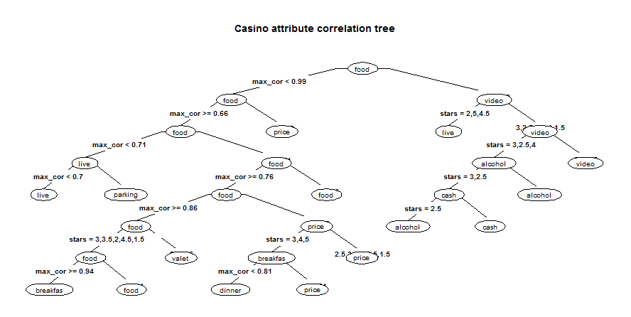
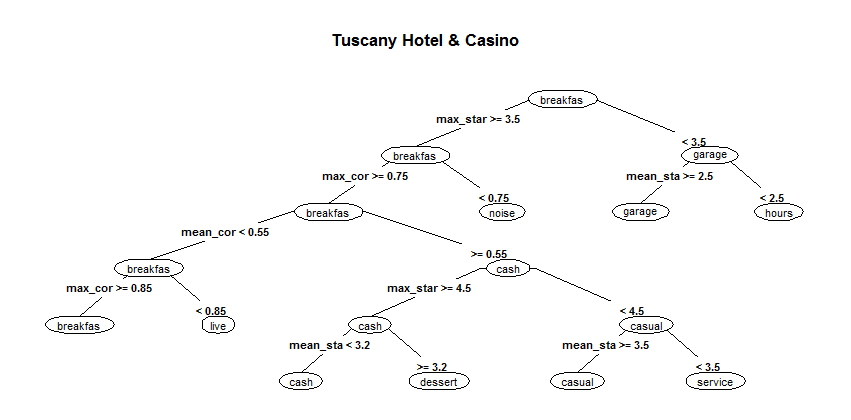

What attributes are important to Las Vegas casino customers?
========================================================
author: Mark Stephens
date: Johns Hopkins Data Science Certification Capstone
class: illustration

##### This project develops predictive & classification models 
##### to answer this question

Food, Drinks, Ambiance?
========================================================
#### When you think about what customers want from a casino what's on that list?

#### Here are 10 attributes that correlate with Yelp reviews...

|name_col   |    stars|   reviews|      corr|
|:----------|--------:|---------:|---------:|
|discover   | 3.500000|  874.5000| 0.7900000|
|karaoke    | 3.500000| 1139.8000| 0.7550000|
|touristy   | 4.000000|  804.0000| 0.7300000|
|dogs       | 3.727273|  601.2727| 0.7263636|
|jukebox    | 3.333333|  421.5000| 0.7233333|
|intimate   | 5.000000| 1211.0000| 0.7100000|
|validated  | 3.000000|  252.0000| 0.7100000|
|dancing    | 3.875000| 1715.0000| 0.7025000|
|television | 3.125000|  780.7500| 0.6887500|
|attire     | 2.000000|  753.5000| 0.6850000|
So What?
========================================================
What if casino managers have the ability to predict 
customer ratings based upon product & service attributes?

This classification tree reveals that across the market food is an important attribute
We can predict casino Yelp star rating based upon attributes found in reviews
========================================================
Prediction model test returns model accuracy of 80%. 

|    |  3| 2.5| 3.5|  4|  2|  5| 4.5| 1.5|
|:---|--:|---:|---:|--:|--:|--:|---:|---:|
|3   | 93|   7|   9|  4|  2|  0|   0|   1|
|2.5 |  1|  48|   3|  0|  1|  0|   0|   0|
|3.5 | 16|  10| 126|  5|  5|  0|   4|   0|
|4   |  1|   0|   3| 48|  0|  1|   1|   0|
|2   |  0|   0|   0|  0|  2|  0|   0|   0|
|5   |  0|   0|   0|  0|  0|  1|   0|   0|
|4.5 |  0|   0|   3|  1|  0|  0|   2|   0|
|1.5 |  0|   0|   0|  0|  0|  0|   0|   2|

.... what can managers learn from customer reviews?
Managers can use a decision tree...
========================================================
to decide where to focus service & improvements

## looks like breakfast is important at Tuscany 
Yelp attribute insights help casino managers
========================================================
1. The predictive model tells us customers focus on attributes
when reviewing and rating casinos
2. Using this analysis shows which attributes customers talk about
3. Using this analysis a casino manager can decide which attributes
may help improve customer ratings 
4. If customer ratings improve, will business results improve too?
