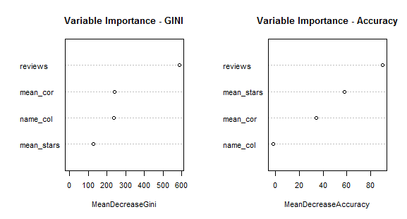
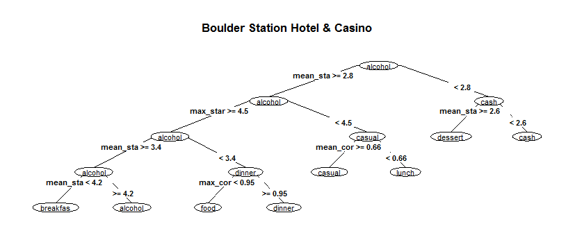

```{r SOURCE_FILES, echo=FALSE, message=FALSE}
### Load Data Sets
source('~/ANALYTICS PROJECTS/CourseraCapstone/CasinoAttributes.R')
source('~/ANALYTICS PROJECTS/CourseraCapstone/load_dfs.R')
source('~/ANALYTICS PROJECTS/CourseraCapstone/CasinoRF.R')

require(knitr)
```

```{r LOAD_DATA, echo=FALSE, cache=FALSE, message=FALSE}
load_dfs()
```

## Introduction - What is this project about?

The goal of this project is to help managers of casinos in Las Vegas, Nevada focus on a set of attributes to maintain or improve Yelp customer reviews and ratings. Transitively through this process, casino managers gain insights to improve the products and services provided by the casino. 

From these insights, casino managers are able to answer questions such as:
- Is ambiance important to casino customers?
- Is live music of interest to casino customers?
- Is food service relevant to casino customers?

Yelp <http://www.yelp.com> provides customers an online platform to review and rate their experience with local businesses such as Las Vegas, Nevada casinos. Customers write reviews in free text form and rate casinos on a 1 to 5 scale (5 = best rating). The overall rating for each casino is based upon the mean of customer ratings.

To achieve the goal of this project, the data science process is applied to create a reproducible method for continuous analysis of Las Vegas, Nevada casino attributes mined from customer reviews and ratings provided in the same format provided by Yelp for the Yelp Data Set Challenge Round 6. 

To produce these insights, this project creates a model that predicts Las Vegas, Nevada casino Yelp customer ratings through attribute association with words in customer reviews. The purpose of this model is to show the relationship between attributes and customer casino ratings. 

If casino rating can be predicted from attributes associated with customer reviews, then communicating attributes that are aligned with each star rating level and highly correlated with customer reviews can help casino managers determine areas of focus for continued service or improvements.

Decision trees are developed to provide insight into which attributes correlate with customer reviews and align with particular rating levels. The model and decision trees are based upon data from 160 casinos and 50,450 reviews.

R code and data utilized in this project can be found at <https://github.com/analyticsexpertise/courseracapstone>.

## Methods & Data - How is the data science process used to generate results?

### Data
For this project, data are sourced from the Yelp Data Set Challenge Round 6 <https://d396qusza40orc.cloudfront.net/dsscapstone/dataset/yelp_dataset_challenge_academic_dataset.zip>.
Data are provided in JSON format. Jsonlite R package is applied to create data frames containing business data, checkins data, review data, tips data, and user data. Subsets of these data frames containing data for casinos located in Las Vegas, Nevada provide structured data as inputs for creation of the final data views for modeling.The table below describes the final data views used in analysis.

Data Frame    | Purpose
------------- | -------------------------------------------------------------------------------
biz_sample    | business id, casino name, casino star rating, and casino customer review count
fitdf         | summary of review & relevant attribute correlation and aligned star ratings
bigcasinodf   | review & attribute correlation and aligned star ratings by casino
casinoTrain   | model training data partitioned from bigcasinodf
casinoTest    | test data partitioned from bigcasinodf

### Predictive Model
After subsetting the business data for Las Vegas, Nevada casinos, 5 sets of relevant attributes are found:ambiance, good for, parking, music, and payment. Applying text mining via findAssocs function of the R tm package finds correlations among the 52 attributes and customer review text. For each attribute, Minimum, Mean, and Maximum correlations are calculated as well as Minimum, Mean, and Maximum star ratings of associated reviews. This analysis is run to create a view utilizing reviews from all casinos (fitdf) and on a per casino basis (bigcasinodf). 

The following table shows a descriptive analysis for top 10 attributes based upon customer review correlation:

```{r ATTR_TOP10, echo=FALSE, message=FALSE}
kable(att_summary())
```

To determine if attributes correlated with customer reviews can predict customer casino rating, bigcasinodf data are partitioned into a training (80%) and test set (20%). The randomForest function of the R randomForest package is used to predict the casino star rating . The random forest model formula is determined by variable importance for accuracy and model organization (GINI).The resulting formula predicts the casino star rating from mean number of stars and mean correlation from analysis of attributes associated with customer review text.



\newpage

Prediction model test returns model accuracy of `r round(rfcm$overall[1],2)*100`%. The following table shows the test results.
`r kable(rfcm$table)`

### Classifying attributes by stars and customer review correlation
To show how attributes correlate with customer reviews and ratings across the entire casino population, a classification tree model is developed using the rpart function of R rpart package. To show maximum correlation of attributes with customer reviews and ratings, maximum correlation and casino customer star ratings are used for model input. 

The model result shows maximum correlation of customer review text as the variable most important for determining attributes of focus by customers.
`r kable(predTree$variable.importance)`


### Classication of attributes for a Casino
To show current attribute correlation for a casino, a classification tree model is developed using the rpart function of R rpart package. All variables (max,mean,and min for star ratings and review text correlation) are used to produce a decision tree showing all paths of review correlation and star rating for the casino of interest.An example classification tree is shown below.



The following sections discuss insights generated by these classification models and implications for casino managers understanding customer interest in casino attributes.

\newpage

## Results - What insights are generated from this analysis?

The predictive model with accuracy of `r round(rfcm$overall[1],2)*100`% shows that customer review text written about casino attributes correlate with the overall rating for the casino. 


The Casino Attribute Tree shows customer attribute correlation for the Yelp reviewed casinos in Las Vegas. 

Based upon reviews in these data, this tree shows FOOD as the main attribute discussed in customer reviews that highly correlate with customers ratings of casinos.For reviews with greater than 0.99 maximum correlation the attributes video, live music, and alcohol align with higher tier stars with cash payment attribute associated with lower rated casinos.Review text with less than 0.99 max correlation add price, parking, breakfast and dinner to the attribute list. Breakfast and dinner are aligned with customer reviews with resulting casino rating of 3,4,and 5 stars.


A casino manager can compare tree structure and contents for an individual casino in relation to the overall market. Casino managers can learn what attributes are distinct and what attributes align. 

For example, the manager of the Tuscany Casino sees that breakfast is an attribute of focus for casino customers in the broader Las Vegas casino market. From the Tuscany Casino tree, breakfast receives broader focus in customer reviews and ratings of this casino. This provides context for a discussion of differntiating casino services within the market as breakfast is a highly correlated attribute across casinos in the market and highly noted for the Tuscany Casino.

## Discussion - What are the implications of these insights?

Can customer reviews be mined to provide insight into relevant attributes for Las Vegas, Nevada casinos? The `r round(rfcm$overall[1],2)*100`% accuracy of the prediction model developed for this project says Yes. 

Yelp has an opportunity to mine customer reviews based upon attributes and provide casino managers insight into what attributes drive customer ratings. If casino customer traffic is affected by Yelp reviews and ratings, attention to review correlated attributes for the broader casino market as well as individual casinos point to areas for action by casino management and staff.


